# University Management System Java
> Note: This is a part of an academic project built using Netbeans 8.2 version, JDK 1.8 and the mysql-connector-j-8.2.0 jar file.
A full-stack web application developed to manage and automate university operations, including student records, faculty management, authentication, academic tracking, and administrative workflows. Built using Java, MySQL, HTML, CSS, and JavaScript, this system provides a scalable and structured solution for handling institutional data with a responsive and user-friendly interface.
## H2 - Login Page
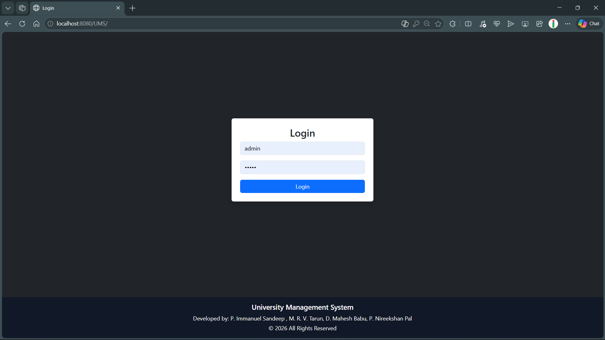
## H2 - Admin Dashboard
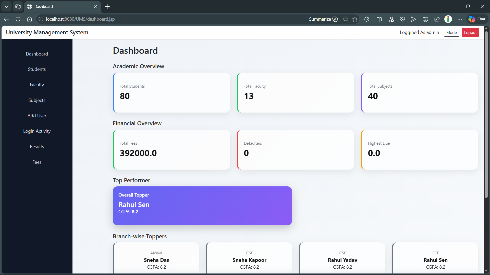
## H2 - Students view Page
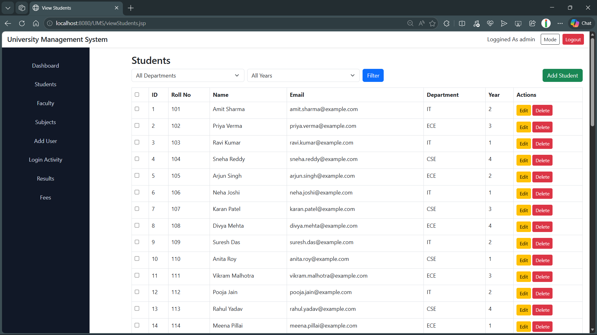
## H2 - Students Addition Page  
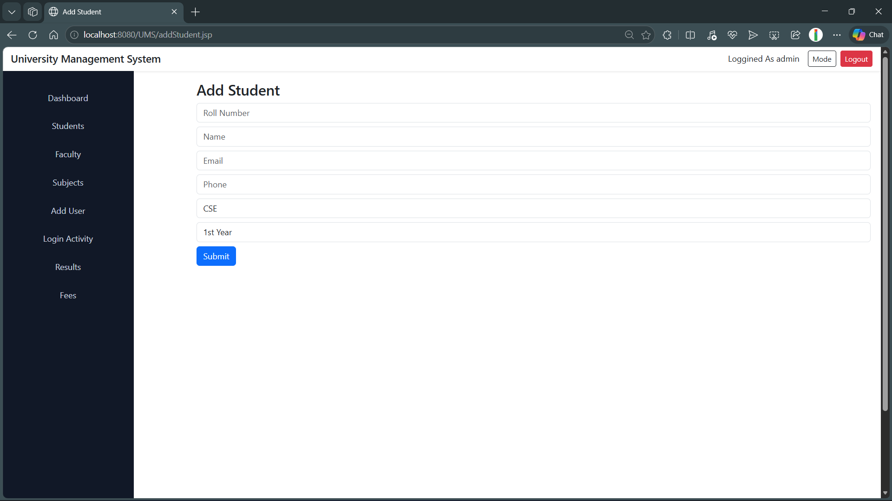
## H2 - Faculty view Page
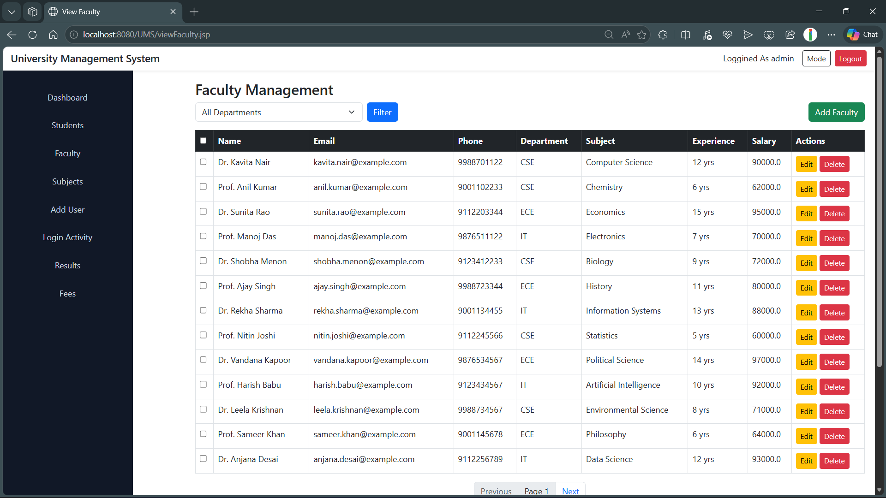
## H2 - Faculty Addition Page
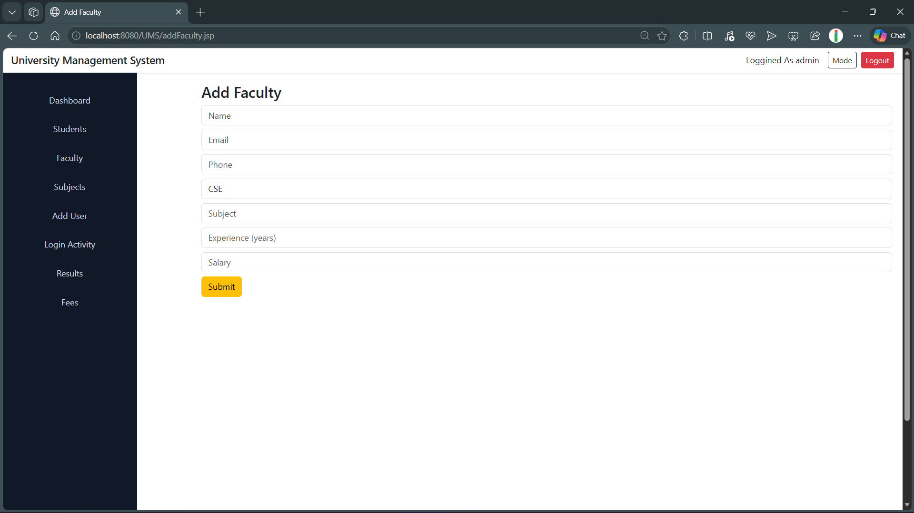
## H2 - Subjects view Page 
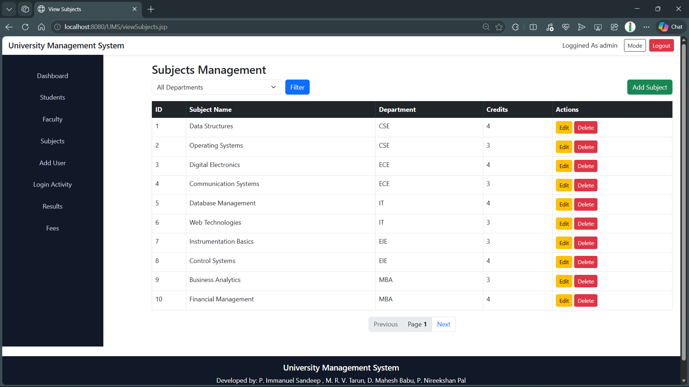
## H2 - Login Activity Record
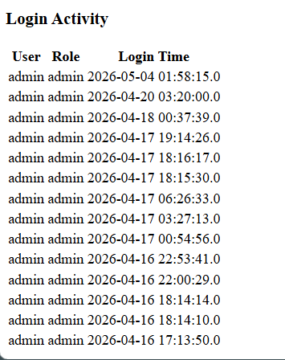
## H2 - Results Dashboard  
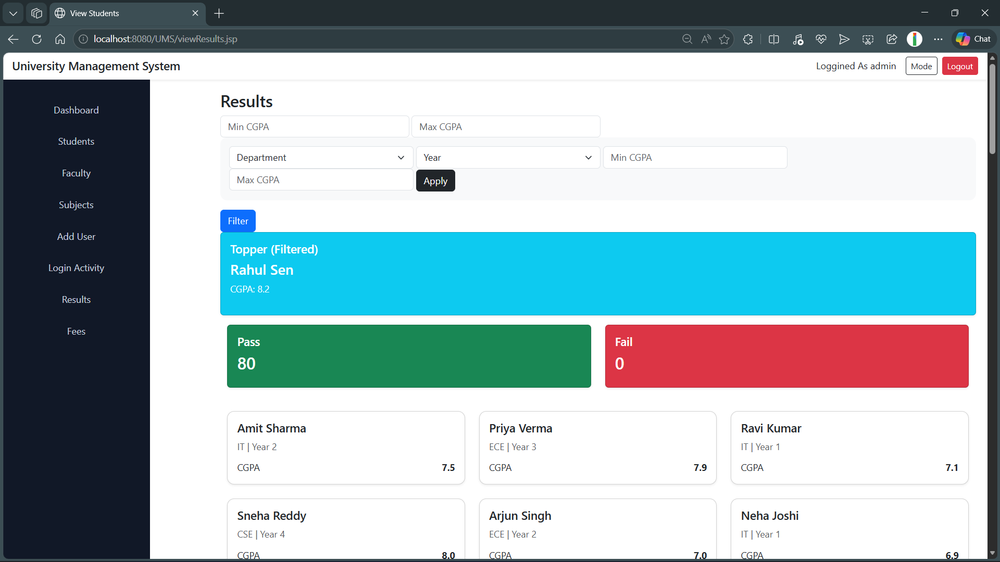
## H2 - Fee Dashboard
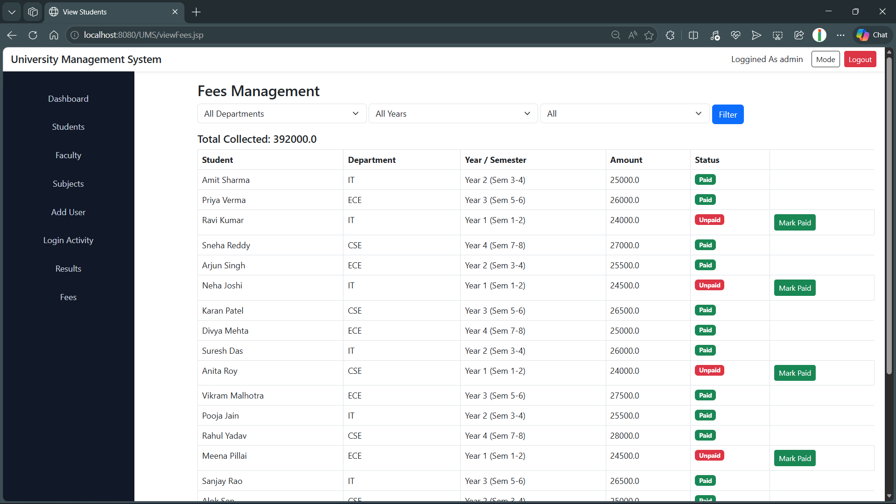
## H2 - Examination Section Login Dashboard

## H2 - Finance Section Login Dashboard

## H2 - XML Configuration File
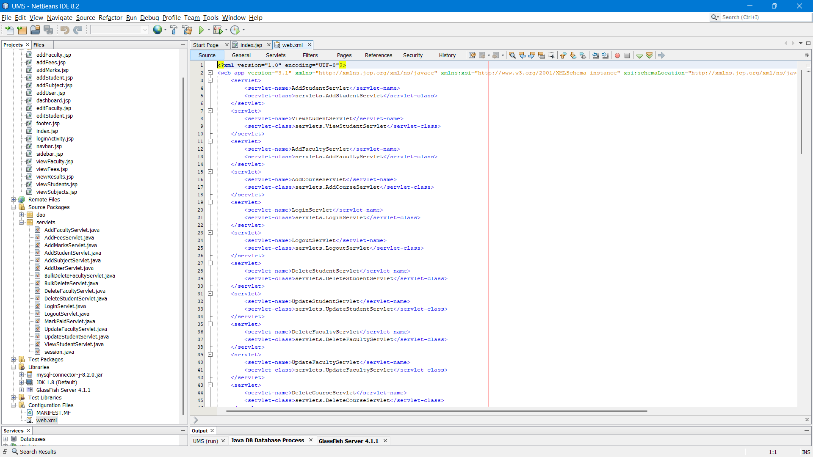
## H2 - DB Connection Page
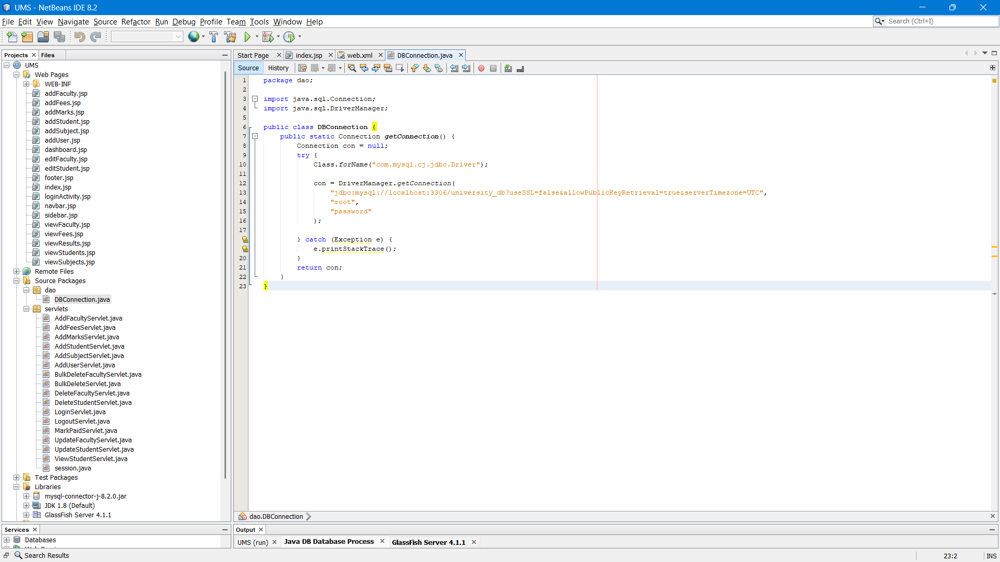
## H2 - Detailed Structure of Files
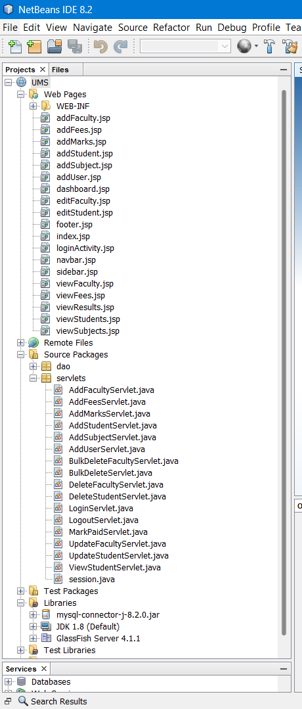
